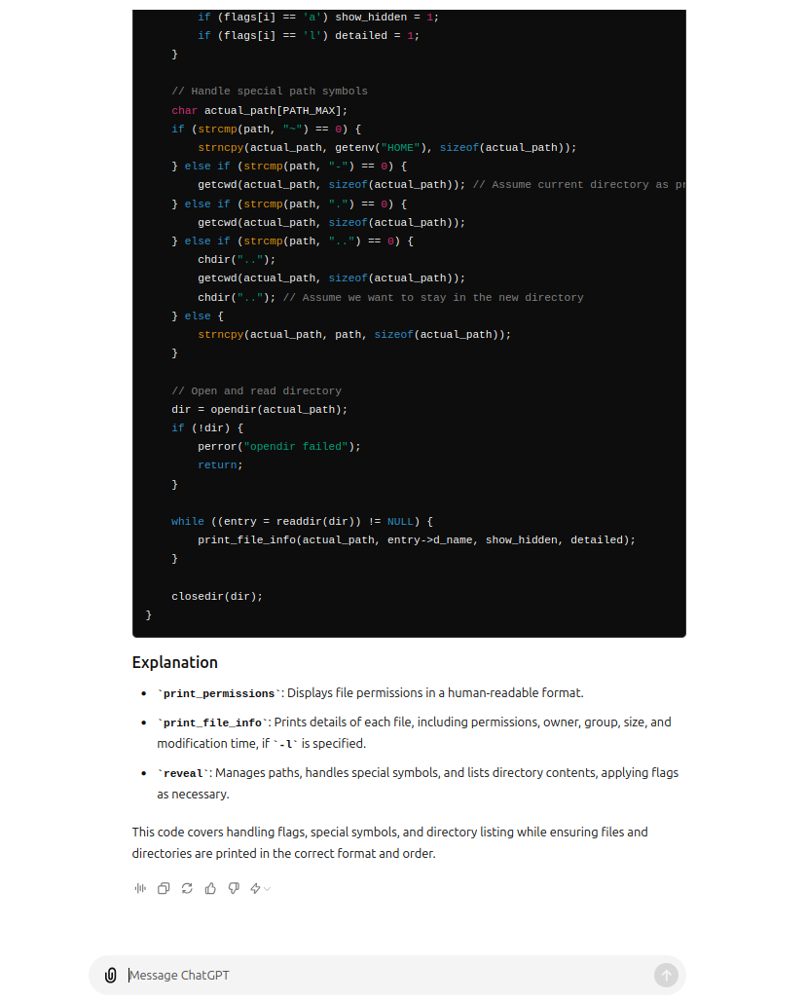
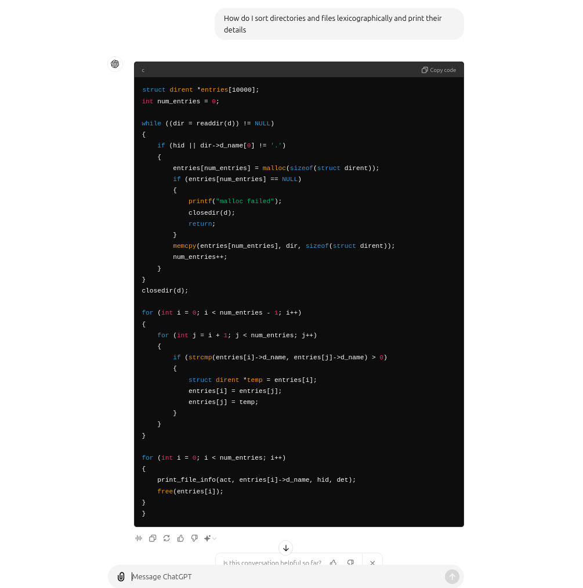
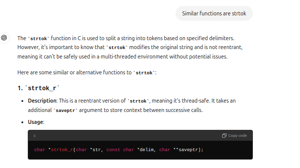

# Custom Shell

## Overview

This project implements a custom shell-like program in C. It provides a command-line interface that supports background and foreground command execution, command logging, and various built-in commands. The shell offers functionalities similar to Unix-based shells and allows users to interact with the file system, manage processes, and execute commands.

## Features

- **Command Execution:** Supports both foreground and background processes. Background processes are executed using `&` and their status is reported when they finish.
- **Command Logging:** Commands are logged and can be executed later using their log index.
- **Custom Commands:**
  - `hop`: Change directories and manage directory navigation.
  - `echo`: Print strings with support for escape sequences and trimming.
  - `reveal`: List files and directories with optional flags for detailed information and hidden files.
  - `seek`: Search for files and directories, with options to filter results and perform actions on single matches.
  - `proclore`: Display information about processes.
- **Log Management:** Commands can be purged or re-executed from the command history.


# Hop Command Implementation

The `hopcmd` function is a custom shell command designed to change directories within a shell environment. It supports various special paths like `~`, `-`, `.`, and `..`, allowing users to navigate the file system efficiently. This README provides a detailed explanation of how the `hopcmd` function is implemented.

## Overview

The `hopcmd` function is responsible for handling directory changes based on a user's input. It supports multiple path segments in a single command, allowing users to navigate to specific directories quickly and intuitively. The function also handles special cases like navigating to the home directory, the previous directory, or parent directories.

## Functionality

### `hopcmd(char *x, char *home, char *prevdir)`

This is the main function responsible for processing the user input, interpreting different path symbols, and executing the directory change.

#### Parameters:
- `x`: The user input string containing one or more directory paths separated by spaces.
- `home`: The path to the home directory, used when the `~` symbol is encountered.
- `prevdir`: The path to the previous directory, used when the `-` symbol is encountered.

#### Implementation Details:

1. **Current Directory Retrieval**:
   - The function begins by retrieving the current directory using `getcwd` and storing it in the `actualdir` array.

2. **Input Parsing**:
   - The user input `x` is tokenized using `strtok`, allowing the function to process each directory path segment separately.

3. **Path Handling**:
   - The function handles several special path symbols:
     - **`~/`**: Replaces this with the home directory path and attempts to navigate to the specified subdirectory within the home directory.
     - **`~`**: Navigates directly to the home directory.
     - **`-`**: Navigates to the previous directory, if available.
     - **`.`**: Represents the current directory; no action is taken.
     - **`..`**: Navigates to the parent directory.
     - **Custom Path**: If none of the above symbols are present, the function attempts to navigate to the specified directory.

4. **Directory Change Execution**:
   - The function checks whether the target directory is accessible using `access`. If the directory is accessible, the function uses `chdir` to change the directory.
   - If the directory change fails, an error message is printed, indicating that the `hop` command has failed.

5. **Permission and Error Handling**:
   - The function handles various permission-related errors, such as when the user does not have execute permissions for the target directory.
   - If the user attempts to navigate to the previous directory without a valid `prevdir`, an error message is displayed.

6. **Looping Through Multiple Paths**:
   - The function supports multiple path segments in a single command. After processing the first path, it continues to process any additional paths provided by the user.


# Reveal Command Implementation

The `reveal` function is a custom shell command designed to list files and directories within a specified directory. It supports options for showing hidden files and displaying detailed information. This README provides a detailed explanation of how the `reveal` function is implemented.

## Overview

The `reveal` function handles the display of directory contents based on user-specified flags. It can display hidden files, show detailed file information, and color-code the output to distinguish between directories, executable files, and regular files.

## Functionality

### `reveal(const char *flags, const char *p, char *home, char *prevdir)`

This is the main function responsible for processing user input, interpreting different flags, and displaying directory contents.

#### Parameters:
- `flags`: A string containing the flags provided by the user (`a` for hidden files, `l` for detailed information).
- `p`: The path to the directory or file the user wants to reveal.
- `home`: The path to the home directory, used when the `~` symbol is encountered.
- `prevdir`: The path to the previous directory, used when the `-` symbol is encountered.

#### Implementation Details:

1. **Flags Parsing**:
   - The function begins by parsing the `flags` string to determine whether hidden files should be shown (`a` flag) and whether detailed information should be displayed (`l` flag).

2. **Path Handling**:
   - The function handles special paths similarly to the `hopcmd` function:
     - **`~`**: Replaces this with the home directory path.
     - **`-`**: Replaces this with the previous directory path, if available.
     - **`.`**: Represents the current directory.
     - **`..`**: Represents the parent directory and involves changing directories temporarily to retrieve the parent path.

3. **Directory and File Handling**:
   - The function first checks if the provided path corresponds to a directory or a file using `stat`.
   - If the path corresponds to a directory, the function opens the directory using `opendir` and reads its contents using `readdir`.
   - Directory entries are stored in an array and sorted alphabetically to ensure a consistent display order.

4. **File Information Display**:
   - The function calls `print_file_info` to display information about each file or directory.
   - If the `l` flag is set, detailed information such as file permissions, the number of links, owner and group names, file size, and modification time is displayed.
   - The function uses `print_permissions` to format and display file permissions.

5. **Color-Coding**:
   - The function color-codes the output:
     - **Directories**: Blue (`\033[1;34m`).
     - **Executable Files**: Green (`\033[1;32m`).
     - **Regular Files**: White (`\033[1;37m`).

6. **Memory Management**:
   - The function dynamically allocates memory for storing directory entries and ensures that memory is freed after use to prevent memory leaks.

### Supporting Functions

#### `print_permissions(int mode)`

This function prints the file permissions in the standard `rwx` format.

- **Parameters**:
  - `mode`: The mode field from the `stat` structure, which contains file permission bits.
  
- **Implementation**:
  - The function checks each bit in the `mode` field and prints `r`, `w`, or `x` for read, write, and execute permissions, respectively. If a permission is not set, it prints `-`.

#### `print_file_info(const char *path, const char *filename, int show_hidden, int detailed)`

This function prints information about a specific file or directory.

- **Parameters**:
  - `path`: The directory path containing the file.
  - `filename`: The name of the file to display.
  - `show_hidden`: A flag indicating whether to display hidden files.
  - `detailed`: A flag indicating whether to display detailed information.
  
- **Implementation**:
  - The function retrieves file statistics using `stat` and, if the `l` flag is set, prints detailed information such as permissions, link count, owner, group, size, and last modification time.
  - The function then color-codes and prints the filename.


# Proclore Command Implementation

The `proclore` function provides detailed information about a specific process identified by its Process ID (PID). It retrieves and displays the process's state, process group ID, virtual memory size, and executable path. This README provides a comprehensive overview of the `proclore` function's implementation.

## Overview

The `proclore` function retrieves process information from the `/proc` filesystem in a Linux environment. It uses various files within the `/proc/[pid]` directory to gather details about the process, such as its state, process group, memory usage, and executable path.

## Functionality

### `proclore(int pid)`

This function is responsible for printing detailed information about a process given its PID.

#### Parameters:
- `pid`: The Process ID of the process whose information is to be retrieved.

#### Implementation Details:

1. **Path Construction**:
   - Constructs paths to the necessary files within the `/proc/[pid]` directory:
     - `/proc/[pid]/stat` for process state and process group ID.
     - `/proc/[pid]/status` for virtual memory size.
     - `/proc/[pid]/exe` for the executable path.

2. **Reading Process State and Process Group**:
   - Opens the `/proc/[pid]/stat` file and reads its contents to extract the process state and process group ID.
   - Uses `sscanf` to parse the state and process group ID from the file contents.
   - Determines if the process is part of the foreground process group by comparing the process group ID with the shell's process group ID (`tcgetpgrp`).

3. **Reading Virtual Memory Size**:
   - Opens the `/proc/[pid]/status` file and reads its contents to locate the line starting with "VmSize:".
   - Extracts the virtual memory size using `sscanf`. If the line is not found, sets the memory size to "0".

4. **Reading Executable Path**:
   - Uses `readlink` to read the symbolic link at `/proc/[pid]/exe` to obtain the path of the executable file.
   - If the link cannot be read, sets the executable path to a space (" ").

5. **Printing Process Information**:
   - Outputs the PID, process status (with foreground/background indicator), process group ID, virtual memory size, and executable path.


   # Seek Command Implementation

The `seek` command is a custom shell command designed to search for files and directories within a specified directory. This README provides a detailed explanation of how the `seek` function and its associated components are implemented.

## Overview

The `seek` command performs a recursive search in a directory, with the ability to filter results based on whether they are files or directories. Additionally, the command can execute specific actions if exactly one match is found. The search results are displayed with color-coded output, making it easier to distinguish between files and directories.

## Functionality

### `seek(int argc, char *argv[], char *home, char *currentdir)`

This is the main function responsible for processing the command-line arguments, setting up the search criteria, and initiating the search. The function handles various flags and parameters, such as:

- **Flags**:
  - `-d`: Search only for directories.
  - `-f`: Search only for files.
  - `-e`: If exactly one match is found, execute an action (change directory or print file contents).
- **Parameters**:
  - `<search>`: The name or prefix of the file/directory to search for.
  - `<target_directory>`: The directory to start the search from. Defaults to the current directory if not specified.

#### Implementation Details:

1. **Argument Parsing**:
   - The function starts by parsing the command-line arguments to identify the flags and search parameters. It ensures that conflicting flags (like `-d` and `-f`) are not used together.

2. **Directory Path Resolution**:
   - The target directory is resolved to an absolute path based on the provided input. If a relative path is given, it is appended to the current directory. If the path starts with `~`, it is replaced with the home directory path.

3. **Search Execution**:
   - The `search_directory` function is called to perform the recursive search based on the resolved directory path, search term, and flags. The function keeps track of the number of matches and stores the path of a single match if found.

4. **Match Handling**:
   - If no matches are found, the function prints "No match found!".
   - If exactly one match is found and the `-e` flag is set, the function executes an action based on whether the match is a directory or a file.

### `search_directory`

This helper function recursively searches through the directory tree starting from a specified path. It filters the search results based on the flags provided and prints the results in a color-coded format.
**Assumptions**
- in this if the commands are like `seek flags tofind` or `seek tofind` in all other cases it will show `invalid command` or `missing tofind`
- in this if theres -e command then .c and .h files will only be printed  .txt files will not be printed

#### Implementation Details:

1. **Directory Traversal**:
   - The function opens the directory specified by `dir_path` and iterates over its contents using `readdir`. For each entry, it skips the special entries `.` and `..`.

2. **Path Construction**:
   - For each directory entry, the full path is constructed by appending the entry name to the current directory path.

3. **File/Directory Filtering**:
   - The function checks if the entry matches the search term. Depending on the flags, it filters out files or directories as needed. Matches are counted, and the first match's path is stored.

4. **Color-Coded Output**:
   - The search results are printed with color codes: directories in blue (`\033[1;34m`) and files in green (`\033[1;32m`).

5. **Recursive Search**:
   - If a directory is found (and it is not a symbolic link), the function calls itself recursively to search within that directory.


# Ecko Command Implementation

The `ecko` function processes a command string by handling comments, trimming spaces, and managing quotes and escape sequences. It ensures that the input is properly formatted and displays it according to specific rules. This README provides an overview of how the `ecko` function is implemented.
**Assumptions**
- in this if the commands dont have `""` or `''` it will work as normal echo
- in this if string has odd number of `"` `'` it will show error 
- if the commands dont have any `"` `'` the string will be printed with trimmend spaces
## Overview

The `ecko` function takes a command string as input and performs the following tasks:
- Removes comments from the string.
- Trims leading and trailing spaces.
- Checks for unmatched quotes and handles escape sequences.
- Outputs the formatted string.

## Functionality

### `ecko(char *command)`

This function processes the input command string based on specific rules and prints the resulting string.

#### Parameters:
- `command`: The input command string to be processed.

#### Implementation Details:

1. **Removing Comments**:
   - Searches for a `#` character in the command string using `strchr`.
   - If found, truncates the string at the `#` character, effectively removing the comment.

2. **Trimming Spaces**:
   - Skips leading spaces by advancing the `start` pointer.
   - Skips trailing spaces by moving the `end` pointer backward until it points to a non-space character.
   - Null-terminates the string at the end of the trimmed portion.

3. **Counting Quotes**:
   - Uses the `count_quotes` function to count the number of single (`'`) and double (`"`) quotes in the trimmed string.
   - Checks if the counts are even; if not, it indicates unmatched quotes.

4. **Handling Unmatched Quotes**:
   - If there are unmatched quotes (odd counts), prints an error message and ignores the input.

5. **Processing Escape Sequences**:
   - Iterates through the string and processes escape sequences (`\'` and `\"`).
   - If a backslash (`\`) is followed by a quote character, it prints the quote character directly.

6. **Outputting the Result**:
   - Prints characters to the standard output while respecting quoted sections and handling escape sequences.
   - Skips spaces outside of quotes but retains spaces within quoted sections.


# Log Execution and Management

The `logexec` function and its associated utilities manage and execute logged commands.
 **Assumptions**:
 - in this only commands like log execute n will work  
 - commands with having log execute n along with `;` and `&` will not work and show some error
 - the above assumptions does not apply to the other log functions as they are only valid for log execute for other log functions it will work as normal

## Overview

The `logexec` function is responsible for executing commands stored in a log. It handles both foreground and background commands, manages the execution time, and integrates with other functions like `hop`, `echo`, `reveal`, `seek`, and `proclore`.

### Functions

#### `load(char log[LOG_SIZE][6000], int *log_count)`

**Description**: Loads commands from a log file into the `log` array.

**Parameters**:
- `log`: Array to store loaded commands.
- `log_count`: Pointer to the count of loaded commands.

**Details**:
- Opens the log file for reading.
- Reads each line into the `log` array until the end of the file or maximum size is reached.
- Handles errors if the file cannot be opened.

#### `saveentry(char log[LOG_SIZE][6000], int log_count, char *currentdir, char *home)`

**Description**: Saves current log entries to the log file.

**Parameters**:
- `log`: Array of log entries.
- `log_count`: Number of log entries.
- `currentdir`: Current working directory (not used in this function).
- `home`: Home directory (not used in this function).

**Details**:
- Opens the log file for writing.
- Writes each log entry to the file.
- Closes the file.

#### `printentries(char log[LOG_SIZE][6000], int log_count)`

**Description**: Prints all log entries.

**Parameters**:
- `log`: Array of log entries.
- `log_count`: Number of log entries.

**Details**:
- Iterates through the `log` array and prints each entry.

#### `addentries(char log[LOG_SIZE][6000], int *log_count, const char *command, char *currentdir, char *home)`

**Description**: Adds a new command to the log.

**Parameters**:
- `log`: Array of log entries.
- `log_count`: Pointer to the number of log entries.
- `command`: Command to add to the log.
- `currentdir`: Current working directory (not used in this function).
- `home`: Home directory (not used in this function).

**Details**:
- Checks if the command is a duplicate of the last log entry.
- If log is full, shifts entries to make space for the new command.
- Saves the updated log to the file.

#### `purge_log(char log[LOG_SIZE][6000], int *log_count, char *currentdir, char *home)`

**Description**: Clears the log.

**Parameters**:
- `log`: Array of log entries.
- `log_count`: Pointer to the number of log entries.
- `currentdir`: Current working directory (not used in this function).
- `home`: Home directory (not used in this function).

**Details**:
- Sets `log_count` to 0.
- Saves the empty log to the file.

#### `logexec(char log[LOG_SIZE][6000], int log_count, int index, char *home, char *prevdir, char *currentdir)`

**Description**: Executes a command from the log at a specific index.

**Parameters**:
- `log`: Array of log entries.
- `log_count`: Number of log entries.
- `index`: Index of the command to execute.
- `home`: Home directory for specific commands.
- `prevdir`: Previous working directory (used in `hop`).
- `currentdir`: Current working directory (used in `hop` and for outputting results).

**Details**:
- Validates the index and retrieves the command from the log.
- Splits the command into foreground and background commands.
- Handles background commands by forking a new process and executing the command.
- Handles foreground commands by executing them in the current process and measuring the execution time.
- Specific commands:
  - **`hop`**: Changes directory.
  - **`echo`**: Prints the command with proper handling of quotes and escape sequences.
  - **`reveal`**: Lists files and directories with options.
  - **`seek`**: Searches for files and directories with options.
  - **`proclore`**: Displays information about a process.


# Alias

**Assumptions**
- any alias can be created in the .myshrc file they cant be created dynamically on the custom shell
- only 2 functions are implemented and only they will work no other finctions can be created
# Custom Shell Alias Handling

alias handling in this custom shell using the `.myshrc` configuration file. It allows defining aliases and functions like `mk_hop` and `hop_seek`, which are substituted in command execution.

## Features

- **Alias Substitution**: Define aliases in the `.myshrc` file, and the shell will automatically substitute them during command execution.
- **Function Handling**: Special handling of functions like `mk_hop` and `hop_seek` where arguments are passed and substituted dynamically.
- **Configurable**: Users can customize their aliases in a simple `.myshrc` file.

## Usage

1. **Aliases in `.myshrc`**: 
   - You can define aliases and functions in the `.myshrc` file. For example:
     ```bash
     reveall=reveal -l
     hopdir=hop /home/user
     cd=hop
     seeklog=seek /var/log
     mk_hop() { mkdir "$1"; hop "$1"; }
     hop_seek() { hop "$1"; seek "$1"; }
     ```

2. **Alias Substitution**:
   - When a command like `mk_hop directory_name` is executed, the alias substitution will expand it to `mkdir directory_name ; hop directory_name`.
   - Similarly, the command `hop_seek directory_name` will expand to `hop directory_name ; seek directory_name`.

## Functions

### `load_aliases(const char *myshrc_path)`

This function reads the `.myshrc` file and loads all defined aliases into the `aliases` array. It also includes logic for handling functions such as `mk_hop` and `hop_seek`.

**Parameters**:
- `myshrc_path`: Path to the `.myshrc` configuration file.

### `substitute_alias(char *cmd)`

This function substitutes aliases found in the input command string `cmd`. If the command matches an alias, it replaces it with the corresponding value from the `aliases` array.

**Parameters**:
- `cmd`: The input command string that may contain aliases.

**Returns**:
- A substituted command string with the aliases expanded.

# iMan


This project implements a feature that allows fetching man pages for specific commands from an external server (in this case, `man.he.net`). It uses sockets to send a GET request to the server and processes the HTML response to extract and display the relevant man page content.

## Features

- **Remote Man Page Retrieval**: Fetches man pages over the internet using sockets and processes the HTML response to display the content.
- **Command-Based Interface**: Users can invoke the `iman` command with the name of the desired man page, and the shell will fetch and display the content.

## Usage

1. **Fetch Man Pages**:
   - Use the `iman` command followed by the desired man page name. For example:
     ```bash
     iman man ls
     ```
   - This will fetch the man page for the `ls` command from the remote server and display it on the terminal.

## Functions

### `fetch_man_page(const char *command)`

This function connects to `man.he.net` using a socket, sends a GET request for the specified command's man page, and processes the HTML response to display the relevant content.

**Parameters**:
- `command`: The name of the command for which the man page should be fetched.

**Key Steps**:
1. Creates a socket connection to `man.he.net`.
2. Sends an HTTP GET request for the man page using the `command` provided.
3. Reads the response from the server.
4. Filters out HTML tags and prints only the man page content to the console.

**Error Handling**:
- The function handles errors such as unknown host, socket creation failure, and connection issues.

### `iman(char **instr, int k)`

This function processes the input arguments to the `iman` command. If the number of arguments is valid, it calls `fetch_man_page` to retrieve and display the man page.

**Parameters**:
- `instr`: Array of input arguments to the shell command.
- `k`: Number of input arguments.

**Functionality**:
- Checks if enough arguments are provided.
- Calls `fetch_man_page` with the appropriate command to retrieve the man page.

Here’s a `README.md` file for the process management code in your custom shell:

---

# Activities / Ping / fg command / bg command

This project provides functionality for managing background and foreground processes in a custom shell. It includes adding, updating, listing, and removing processes, handling signals like `SIGCHLD`, and bringing processes to the foreground or background.

## Features

- **Add and Update Processes**: Track processes started by the shell, update their states, and manage process information.
- **Foreground and Background Control**: Move processes between the foreground and background, resume stopped processes, and send signals to specific processes.
- **Signal Handling**: Automatically handle child process signals (`SIGCHLD`) and user-defined signals to manage process states.

## Usage

### Adding Processes

Use the `add_process` function to track a process in the shell’s process table.

`
add_process("command_name", pid, "Running");
`

### Updating Process State

To update the state of a process (e.g., when it's stopped or resumed), use:

`
update_process_state(pid, "Stopped");
`

### Stopping All Running Processes

The shell can stop all running processes using `stop_all_running_processes`:

`
stop_all_running_processes();
`

This function sends `SIGKILL` to all processes tracked in the process list.

### Bringing a Process to the Foreground

To bring a process to the foreground, use:

`
bring_to_foreground(pid);
`

This will resume the process (if stopped) and give it control of the terminal.

### Resume a Process in the Background

To resume a stopped process in the background, use:

`
resume_in_background(pid);
`

This sends the `SIGCONT` signal to the process and updates its state to "Running".

### Signal Handling

The `sigchld_handler` function automatically handles child process termination or stopping. This is triggered when a child process sends `SIGCHLD`.

`
signal(SIGCHLD, sigchld_handler);
`

### Ping a Process with a Signal

To send a signal to a process, use:

`
ping_process(pid, signal_number);
`

This function checks if the process exists and sends the specified signal.

## Functions

### `find_process_by_pid(pid_t pid)`

Finds a process in the process list by its PID.

**Parameters**:
- `pid`: The process ID.

**Returns**:
- A pointer to the process information if found, or `NULL` if the process is not in the list.

### `add_process(const char *command_name, pid_t pid, const char *state)`

Adds a new process to the process list.

**Parameters**:
- `command_name`: The name of the command.
- `pid`: The process ID.
- `state`: The initial state of the process (e.g., "Running", "Stopped").

### `update_process_state(pid_t pid, const char *state)`

Updates the state of a process based on its PID.

**Parameters**:
- `pid`: The process ID.
- `state`: The new state of the process.

### `stop_all_running_processes()`

Stops all processes in the process list by sending them `SIGKILL` and removes them from the list.

### `remove_process(pid_t pid)`

Removes a process from the list by its PID.

**Parameters**:
- `pid`: The process ID.

### `compare_processes(const void *a, const void *b)`

Helper function for sorting processes alphabetically by their command name using `qsort`.

**Returns**:
- An integer less than, equal to, or greater than zero depending on the comparison result.

### `activities()`

Lists all processes currently in the process list, sorted alphabetically by their command name.

### `sigchld_handler(int signum)`

Handles the `SIGCHLD` signal, which is sent when a child process terminates or stops. It updates process states accordingly or removes the process if it has terminated.

### `bring_to_foreground(pid_t pid)`

Brings the specified process to the foreground and gives it terminal control.

### `resume_in_background(pid_t pid)`

Resumes a stopped process in the background by sending `SIGCONT`.

### `ping_process(int pid, int signal_number)`


# Neonate Command in Custom Shell

This project provides a custom `neonate_n_command` for managing non-blocking input, process handling, and system interaction in a custom shell. It includes non-blocking terminal settings, retrieving the latest process ID, and managing user input using `select()`.

## Features

- **Non-blocking Terminal Mode:** Switches the terminal to non-blocking mode, allowing for non-canonical input without echoing.
- **Process Management:** Retrieves the latest process ID from the `/proc` directory.
- **Timed Input Handling:** Listens for user input (`'x'` to stop) within a specified time interval.
- **Restores Terminal Settings:** Ensures the terminal settings are restored to their original state after execution.

## Functions

### `set_non_blocking_mode()`

Enables non-blocking input mode for the terminal.

- **Usage:**

  This function configures the terminal to disable canonical mode (where input is processed after pressing enter) and disables input echo. It also sets the file descriptor for `STDIN_FILENO` to non-blocking mode using `fcntl()`.


### `restore_terminal_mode()`

Restores the terminal to its default blocking mode with canonical input.

- **Usage:**

  This function re-enables canonical input mode and input echo, and it ensures the terminal file descriptor is no longer in non-blocking mode.


### `get_latest_pid()`

Finds and returns the latest process ID from the `/proc` directory.

- **Usage:**

  This function traverses the `/proc` directory, retrieves the creation time of each process, and returns the process ID of the most recently created process.

- **Returns:**
  - The latest process ID or `-1` if an error occurs.


### `neonate_n_command(int time_arg)`

Executes the neonate command, which retrieves the latest process ID at intervals specified by `time_arg` and listens for user input to stop the command.

- **Parameters:**
  - `time_arg`: The interval (in seconds) between checks for the latest process ID.

- **Usage:**

  This function sets the terminal to non-blocking mode, retrieves the latest process ID in a loop, and listens for the user to press `'x'` to stop the command. It uses the `select()` system call to manage input and timeout behavior.

- **Example:**

  `
  neonate_n_command(5); // Checks every 5 seconds
  `

- **Input:**
  - Press `'x'` to stop the command.


# Redirection and Pipeline

**Assumptions**
- in this i have first tokenised in such a way that first i am tokenising with `&` and after that i am tokenising with `|` if theres a `|` after tokenising with `&` lets say cmd1 | cmd 2 & then i am handling it in such a way that cmd1 will run in fg and cmd2 will have input of cmd1 and will run in bg 
- if the command is like `cmd > a.txt > a1.txt` or ` cmd < a.txt < a1.txt ` also there will be only 1 input `<` and 1 output `> >>` if theres more than one input or output then there will be error
- if theres `|` in the start or end it will show an error
- if there is command which has `& |` then it will work till & and then show an error for example `cmd & | wc ` then cmd & will happen in bg and then it will show an error
- if there `||` between pipes theres no space then it will only work till pipe for example ` echo hello || wc ` only echo hello will be executed
- if theres command like `| |` then it will show invalid command (there is space between pipes)
- if theres command like `echo hello > a.txt world` then hello world will be redirected in a.txt
  
# some extra assumptions
- used setpgid(0,0) in main function so vim will not open in foreground
- double quotes function will not work in execvp
- if i do sleep 10 and then do ctrl z then i do fg of that stopped sleep 10 then it wont work for exactly that much time


### use of AI
   
   
   
   
   
   
   
   
   
   
   
   
   #### activities
   
   
   #### alias
   
   
   
   
   #### fg
   
   
   
   #### iMan
   
   
   
   
   #### neonate
   
   
   
   
   #### piping
   
   
   


