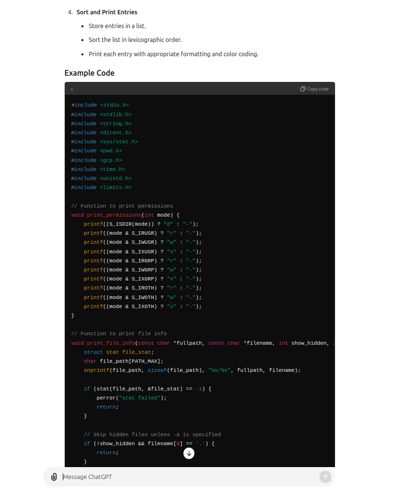
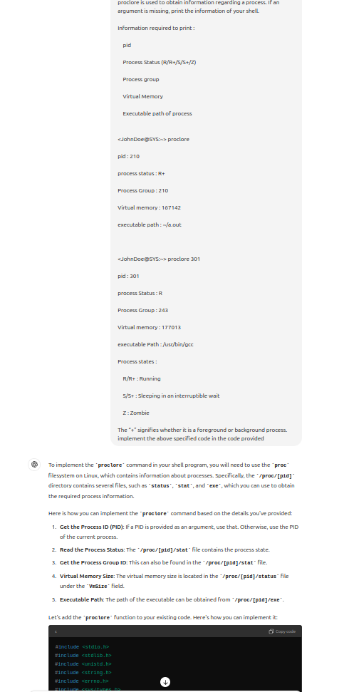
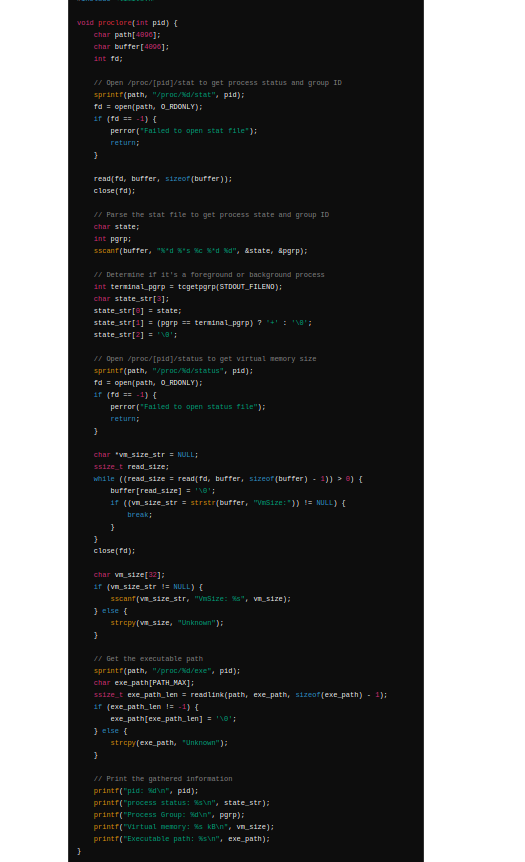
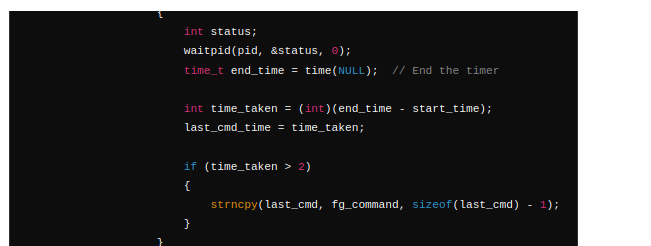

# Custom Shell

## Overview

This project implements a custom shell-like program in C. It provides a command-line interface that supports background and foreground command execution, command logging, and various commands. The custom shell offers functionalities similar to Unix-based shells and allows users to execute various commands.

## Features

- **Command Execution:** Supports both foreground and background processes. Background processes are executed using `&` and their status is reported when they finish and multiple commands can be given by using ";".
- **Command Logging:** Commands are logged and can be executed later using their log index.
- **Custom Commands:**
  - `hop`: Change directories and manage directory navigation.
  - `echo`: Print strings with support for escape sequences and trimming.
  - `reveal`: List files and directories with optional flags for detailed information and hidden files.
  - `seek`: Search for files and directories, with options to filter results and perform actions on single matches.
  - `proclore`: Display information about processes.
- **Log Management:** Commands can be purged or re-executed from the command history.

# Hop Command Implementation

The `hopcmd` function is a custom shell command designed to change directories within a shell environment. It supports various special paths like `~`, `-`, `.`, and `..`, allowing users to navigate the file system efficiently. This README provides a detailed explanation of how the `hopcmd` function is implemented.

#### Implementation Details:

1. **Current Directory Retrieval**:
   - The function begins by retrieving the current directory using `getcwd` and storing it in the `actualdir` array.

2. **Input Parsing**:
   - The user input `x` is tokenized using `strtok`, allowing the function to process each directory path segment separately.

3. **Path Handling**:
   - The function handles several special path symbols:
     - **`~/`**: Replaces this with the home directory path and attempts to navigate to the specified subdirectory within the home directory.
     - **`~`**: Navigates directly to the home directory.
     - **`-`**: Navigates to the previous directory, if available.
     - **`.`**: Represents the current directory; no action is taken.
     - **`..`**: Navigates to the parent directory.
     - **Custom Path**: If none of the above symbols are present, the function attempts to navigate to the specified directory.

4. **Directory Change Execution**:
   - The function checks whether the target directory is accessible using `access`. If the directory is accessible, the function uses `chdir` to change the directory.
   - If the directory change fails, an error message is printed, indicating that the `hop` command has failed.

6. **Looping Through Multiple Paths**:
   - The function supports multiple path segments in a single command. After processing the first path, it continues to process any additional paths provided by the user.

# Reveal Command Implementation

The `reveal` function is a custom shell command designed to list files and directories within a specified directory. It supports options for showing hidden files and displaying detailed information.

#### Implementation Details:

1. **Flags Parsing**:
   - The function begins by parsing the `flags` string to determine whether hidden files should be shown (`a` flag) and whether detailed information should be displayed (`l` flag).

2. **Path Handling**:
   - The function handles special paths similarly to the `hopcmd` function:
     - **`~`**: Replaces this with the home directory path.
     - **`-`**: Replaces this with the previous directory path, if available.
     - **`.`**: Represents the current directory.
     - **`..`**: Represents the parent directory and involves changing directories temporarily to retrieve the parent path.

3. **Directory and File Handling**:
   - The function first checks if the provided path corresponds to a directory or a file using `stat`.
   - If the path corresponds to a directory, the function opens the directory using `opendir` and reads its contents using `readdir`.
   - Directory entries are stored in an array and sorted alphabetically to ensure a consistent display order.

4. **File Information Display**:
   - The function calls `print_file_info` to display information about each file or directory.
   - If the `l` flag is set, detailed information such as file permissions, the number of links, owner and group names, file size, and modification time is displayed.
   - The function uses `print_permissions` to format and display file permissions.

5. **Color-Coding**:
   - The function color-codes the output:
     - **Directories**: Blue (`\033[1;34m`).
     - **Executable Files**: Green (`\033[1;32m`).
     - **Regular Files**: White (`\033[1;37m`).

6. **Memory Management**:
   - The function dynamically allocates memory for storing directory entries and ensures that memory is freed after use to prevent memory leaks.

### Supporting Functions

#### `print_permissions(int mode)`

This function prints the file permissions in the standard `rwx` format.

  
- **Implementation**:
  - The function checks each bit in the `mode` field and prints `r`, `w`, or `x` for read, write, and execute permissions, respectively. If a permission is not set, it prints `-`.

#### `print_file_info(const char *path, const char *filename, int show_hidden, int detailed)`

This function prints information about a specific file or directory.
  
- **Implementation**:
  - The function retrieves file statistics using `stat` and, if the `l` flag is set, prints detailed information such as permissions, link count, owner, group, size, and last modification time.
  - The function then color-codes and prints the filename.

# Proclore Command Implementation

The `proclore` function provides detailed information about a specific process identified by its Process ID (PID). It retrieves and displays the process's state, process group ID, virtual memory size, and executable path.

#### Implementation Details:

1. **Path Construction**:
   - Constructs paths to the necessary files within the `/proc/[pid]` directory:
     - `/proc/[pid]/stat` for process state and process group ID.
     - `/proc/[pid]/status` for virtual memory size.
     - `/proc/[pid]/exe` for the executable path.

2. **Reading Process State and Process Group**:
   - Opens the `/proc/[pid]/stat` file and reads its contents to extract the process state and process group ID.
   - Uses `sscanf` to parse the state and process group ID from the file contents.
   - Determines if the process is part of the foreground process group by comparing the process group ID with the shell's process group ID (`tcgetpgrp`).

3. **Reading Virtual Memory Size**:
   - Opens the `/proc/[pid]/status` file and reads its contents to locate the line starting with "VmSize:".
   - Extracts the virtual memory size using `sscanf`. If the line is not found, sets the memory size to "0".

4. **Reading Executable Path**:
   - Uses `readlink` to read the symbolic link at `/proc/[pid]/exe` to obtain the path of the executable file.
   - If the link cannot be read, sets the executable path to a space (" ").

5. **Printing Process Information**:
   - Outputs the PID, process status (with foreground/background indicator), process group ID, virtual memory size, and executable path.

   # Seek Command Implementation

The `seek` command is a custom shell command designed to search for files and directories within a specified directory. 

- **Flags**:
  - `-d`: Search only for directories.
  - `-f`: Search only for files.
  - `-e`: If exactly one match is found, execute an action (change directory or print file contents).
- **Parameters**:
  - `<search>`: The name or prefix of the file/directory to search for.
  - `<target_directory>`: The directory to start the search from. Defaults to the current directory if not specified.

#### Implementation Details:

1. **Argument Parsing**:
   - The function starts by parsing the command-line arguments to identify the flags and search parameters. It ensures that conflicting flags (like `-d` and `-f`) are not used together.

2. **Directory Path Resolution**:
   - The target directory is resolved to an absolute path based on the provided input. If a relative path is given, it is appended to the current directory. If the path starts with `~`, it is replaced with the home directory path.

3. **Search Execution**:
   - The `search_directory` function is called to perform the recursive search based on the resolved directory path, search term, and flags. The function keeps track of the number of matches and stores the path of a single match if found.

4. **Match Handling**:
   - If no matches are found, the function prints "No match found!".
   - If exactly one match is found and the `-e` flag is set, the function executes an action based on whether the match is a directory or a file.

### `search_directory`

This helper function recursively searches through the directory tree starting from a specified path. It filters the search results based on the flags provided and prints the results in a color-coded format.

#### Implementation Details:

1. **Directory Traversal**:
   - The function opens the directory specified by `dir_path` and iterates over its contents using `readdir`. For each entry, it skips the special entries `.` and `..`.

2. **Path Construction**:
   - For each directory entry, the full path is constructed by appending the entry name to the current directory path.

3. **File/Directory Filtering**:
   - The function checks if the entry matches the search term. Depending on the flags, it filters out files or directories as needed. Matches are counted, and the first match's path is stored.

4. **Color-Coded Output**:
   - The search results are printed with color codes: directories in blue (`\033[1;34m`) and files in green (`\033[1;32m`).

5. **Recursive Search**:
   - If a directory is found (and it is not a symbolic link), the function calls itself recursively to search within that directory.

# Ecko Command Implementation

The `ecko` function processes a command string by handling comments, trimming spaces, and managing quotes and escape sequences. It ensures that the input is properly formatted and displays it according to specific rules.

#### Parameters:
- `command`: The input command string to be processed.

#### Implementation Details:

1. **Removing Comments**:
   - Searches for a `#` character in the command string using `strchr`.
   - If found, truncates the string at the `#` character, effectively removing the comment.

2. **Trimming Spaces**:
   - Skips leading spaces by advancing the `start` pointer.
   - Skips trailing spaces by moving the `end` pointer backward until it points to a non-space character.
   - Null-terminates the string at the end of the trimmed portion.

3. **Counting Quotes**:
   - Uses the `count_quotes` function to count the number of single (`'`) and double (`"`) quotes in the trimmed string.
   - Checks if the counts are even; if not, it indicates unmatched quotes.

4. **Handling Unmatched Quotes**:
   - If there are unmatched quotes (odd counts), prints an error message and ignores the input.

5. **Processing Escape Sequences**:
   - Iterates through the string and processes escape sequences (`\'` and `\"`).
   - If a backslash (`\`) is followed by a quote character, it prints the quote character directly.

6. **Outputting the Result**:
   - Prints characters to the standard output while respecting quoted sections and handling escape sequences.
   - Skips spaces outside of quotes but retains spaces within quoted sections.
   - 
 if theres a string having no quotes then the words of the string will be concatenated and printed as a single large string

# Log Execution and Management

The `logexec` function and its associated utilities manage and execute logged commands. 
#### `load(char log[LOG_SIZE][6000], int *log_count)`

**Details**:
- Opens the log file for reading.
- Reads each line into the `log` array until the end of the file or maximum size is reached.
- Handles errors if the file cannot be opened.

#### `saveentry(char log[LOG_SIZE][6000], int log_count, char *currentdir, char *home)`

**Description**: Saves current log entries to the log file.

**Details**:
- Opens the log file for writing.
- Writes each log entry to the file.
- Closes the file.

#### `printentries(char log[LOG_SIZE][6000], int log_count)`

**Description**: Prints all log entries.

**Details**:
- Iterates through the `log` array and prints each entry.

#### `addentries(char log[LOG_SIZE][6000], int *log_count, const char *command, char *currentdir, char *home)`

**Description**: Adds a new command to the log.

**Details**:
- Checks if the command is a duplicate of the last log entry.
- If log is full, shifts entries to make space for the new command.
- Saves the updated log to the file.

#### `purge_log(char log[LOG_SIZE][6000], int *log_count, char *currentdir, char *home)`

**Description**: Clears the log.

**Details**:
- Sets `log_count` to 0.
- Saves the empty log to the file.

#### `logexec(char log[LOG_SIZE][6000], int log_count, int index, char *home, char *prevdir, char *currentdir)`

**Description**: Executes a command from the log at a specific index.

**Details**:
- Validates the index and retrieves the command from the log.
- Splits the command into foreground and background commands.
- Handles background commands by forking a new process and executing the command.
- Handles foreground commands by executing them in the current process and measuring the execution time.
- Specific commands:
  - **`hop`**: Changes directory.
  - **`echo`**: Prints the command with proper handling of quotes and escape sequences.
  - **`reveal`**: Lists files and directories with options.
  - **`seek`**: Searches for files and directories with options.
  - **`proclore`**: Displays information about a process.
  -  **`background/foreground process`**: based on if & is present in the string it does background or foreground process

### use of AI
  
   
   
   
   
   
   
   
   
   
   
   
   
   
   
   
   
   
   
   

